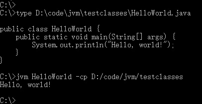

# JVM
A JVM written in C.

开发环境 win10 + clion + MinGW

## Dependence
本项目依赖 zlib, minizib 库，请确保在 MinGW 中下载了它们。

基于jre8.

## 命令行参数
* -bcp path: Bootstrap Class Path, JavaHome路径, 对应 jre/lib 目录。
* -cp path: Class Path, user class path.
-cp 选项的优先级更高，可以覆盖CLASSPATH环境变量设置。
-cp 选项既可以指定多个目录和JAR文件，以分号隔开。

## 示例
#### Hello World

## 参考资料
1. 自己动手写Java虚拟机，张秀宏。
2. 深入理解Java虚拟机——JVM高级特性与最佳实践(第2版)，周志明。
