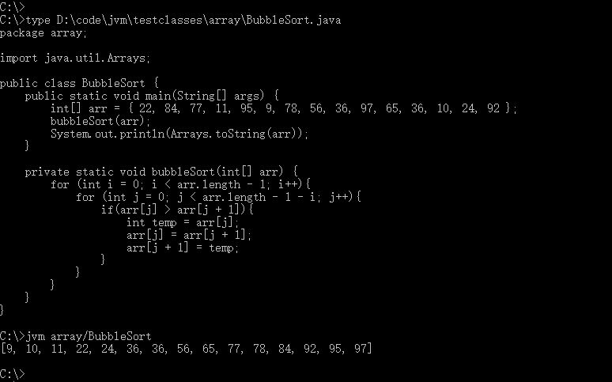
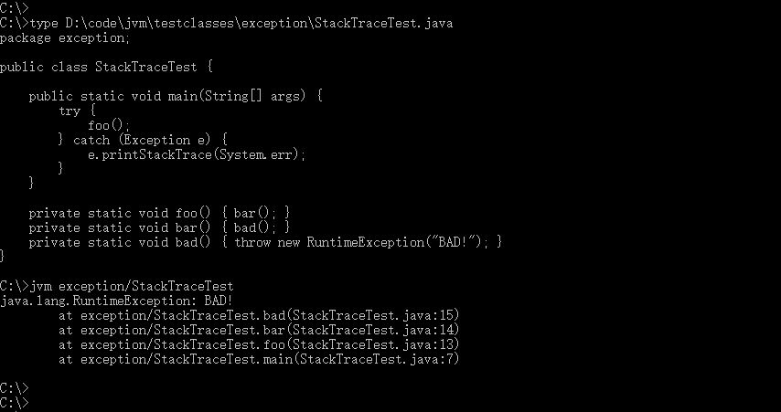

# JVM
A JVM written in C.

开发环境 win10 + clion + MinGW

## Dependence
本项目依赖 zlib, minizib 库，请确保在 MinGW 中下载了它们。

基于jre8.

## 命令行参数
* -bcp path: Bootstrap Class Path, JavaHome路径, 对应 jre/lib 目录。
* -cp path: Class Path, user class path.
-cp 选项的优先级更高，可以覆盖CLASSPATH环境变量设置。
-cp 选项既可以指定多个目录和JAR文件，以分号隔开。

## 示例
#### Hello World
```java
public class HelloWorld {
    public static void main(String[] args) {
        System.out.println("Hello, world!");
    }
}
```
使用 -bcp 指定了java库路径，使用 -cp 指定 CLASSPATH。


#### Bubble Sort
```java
package array;

import java.util.Arrays;

public class BubbleSort {
    public static void main(String[] args) {
        int[] arr = { 22, 84, 77, 11, 95, 9, 78, 56, 36, 97, 65, 36, 10, 24, 92 };
        bubbleSort(arr);
        System.out.println(Arrays.toString(arr));
    }

    private static void bubbleSort(int[] arr) {
        for (int i = 0; i < arr.length - 1; i++){
            for (int j = 0; j < arr.length - 1 - i; j++){
                if(arr[j] > arr[j + 1]){
                    int temp = arr[j];
                    arr[j] = arr[j + 1];
                    arr[j + 1] = temp;
                }
            }
        }
    }
}
```
没有指定Java库路径和CLASSPATH，使用环境变量 JAVA_HOME 和 CLASSPATH。


#### Stack Trace
```java
package exception;

public class StackTraceTest {

    public static void main(String[] args) {
        try {
            foo();
        } catch (Exception e) {
            e.printStackTrace(System.err);
        }
    }

    private static void foo() { bar(); }
    private static void bar() { bad(); }
    private static void bad() { throw new RuntimeException("BAD!"); }
}
```


## 参考资料
1. 自己动手写Java虚拟机，张秀宏。
2. 深入理解Java虚拟机——JVM高级特性与最佳实践(第2版)，周志明。
